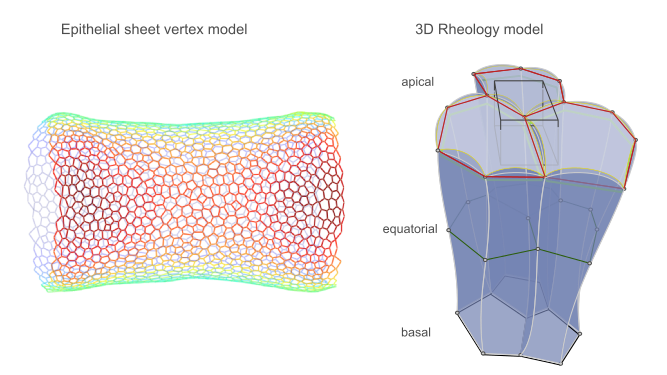

# tyssue
## An epithelium simulation library

The `tyssue` library seeks to provide a unified interface to implement
bio-mechanical models of living tissues, with a focus on **epithelium** modeling.

> An epithelium is a collection of connective cells forming a
> single cell thick sheet.

### What kind of Models does it implement?

The first model that will be implemented is the one described in
Monier et al. [monier2015apico]. It is an example of a vertex model,
where the interactions are only evaluated on the apical surface sheet
of the epithelium. The second class of models are still at an
stage. They implement a description of the tissue's rheology, within a
dissipation function formalism.

### Authors

* Cyprien Gay @cypriengay
* Guillaume Gay (maintainer) - @glyg
* François Molino
* Magali Suzanne

## Dependencies

### Python

- Python >= 3.4
- numpy >= 1.8
- scipy >= 0.12
- pandas >= 0.13
- matplotlib >= 1.3
- graph_tool >= 2.2.37

### C++
- Boost >= 1.54
- CGAL >= 3.5

## Object Architecture

We distinguish **cell-based** and **continuous** epithelium
models. This library focuses on cell based lattice free models (for a
very complete discussion on the different models of living tissues,
see C. Tamulonis' excellent PhD thesis [Tamulonis2013] and continuous
models for whole tissue modeling (with a spatial 'grain' much bigger
than a single cell). Enphasis and development effort is first put on
cell based models

### Cell based models

#### Common elements

The graphic below details the various objects modeled here. Each of
those are implemented as an abstract class. If one considers the model
in Monier et al. [monier2015apico], the apical sheet is consituted of
vertices and edges, representing apical junctions. This geometry can
be generalized to model 3D columnar cells constituted of apical, basal
and equatorial meshes, linked by sagital edges. Depending on the
model, a subset of those junctions will be used. Each cell interacts
with its neighbour through its junctions. An epithelium is then a
graph of interacting cells, with two cells neighbouring cells sharing
a junction.

All the physical objects are represented by
[CGAL Linear Cell Complexes - in short LCC](http://doc.cgal.org/latest/Linear_cell_complex/index.html),
that are specialized versions of
[CGAL Combinatorial Maps](http://doc.cgal.org/latest/Combinatorial_map/index.html). Vertices
are 0-cells (associated to a Point object in the LCC), edges 1-cells,
facets are 2-cells and volume are 3-cells [1]. With this concept,
individual cells as well as the whole epithelium are represented by a
LCC. As can be seen by browsing the above linked documentations, this
very general framework provides efficient ways to represent the tissue
and common events such as cell division (using
`lcc.insert_point_in_cell`). For a given model, only subsets of these
objects might be needed, but we'll try to keep the various definitions
as generic as possible, for example by defining cell division
irrespective of the detailed geometry of the cell, through template meta-programming

Note that we might need to further sub-class CGAL's LinearCellComplex
to take into account the possibility of curved edges and faces in the
vertex rheology models.

#### Python API

If the core computation and objects are defined in C++ through CGAL,
we use `boost::python` to expose these objects in Python. The
objective is to have an easy and reactive way to define and run
different simulation scenarios. An essential aspect of this C++/Python
framework will be to expose `CGAL::CellAttribute` instances as
Numpy `ndarray`, to ease data exploration, visualization and analysis,
as is done for graph-tool `PropertyMap` objects.

The general idea here is to implement in C++ all the core components
of each model class (which can also be seen as physical engines), and
develop simulation specific definitions in python.

## Continuous Models

Here the base object is derived from CGAL `Polyhedron_3` and is a
segmentation of the whole tissue. The (yet to be) implemented model is
based on the formalism described in [Tlili2013]

## Similar softwares

TODO

## Bibliography

* Here is a [Mendeley group](https://www.mendeley.com/groups/7132031/tyssue/) for the project's
  bibliography

* There is also a good old [Bibtex file here](bibliography/tyssue.bib)

[monier2015apico]: Monier, B. et al. Apico-basal forces exerted by
  apoptotic cells drive epithelium folding. Nature 518, 245–248 (2015).

[Tamulonis2013]: Tamulonis, C. Cell-based models. (Universiteit ven Amsterdam, 2013). doi:10.1177/1745691612459060.

[Tlili2013]: Tlili,S. et al. Mechanical formalism for tissue dynamics. 6, 23 (2013).

[1]: The fact that the LCC model uses the term `cell` as it's core
  concept is unfortunate. This will be hidden in the python API of the project.
